<p align="center">
  <a href="https://gray0072.github.io/swedish/">
    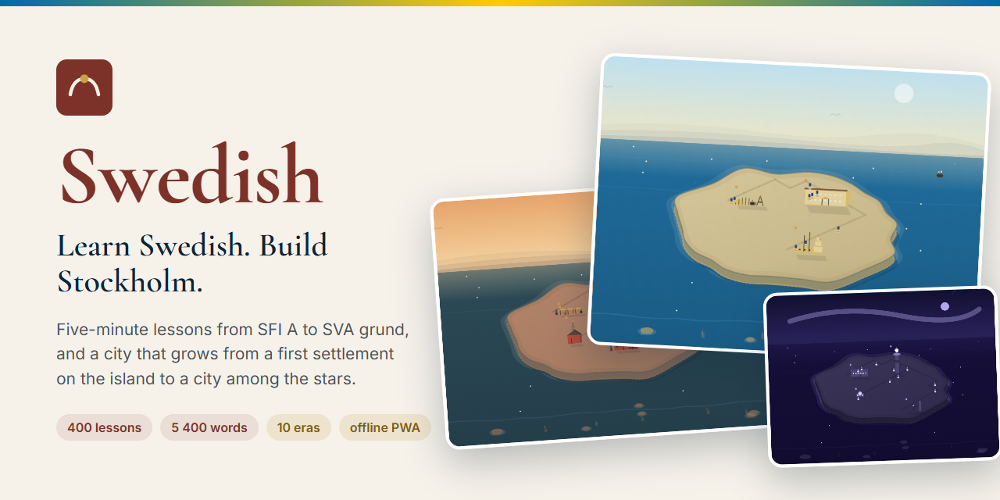
  </a>
</p>

<p align="center">
  <a href="https://gray0072.github.io/swedish/"><strong>▶&nbsp; Open the app</strong></a>
  &nbsp;·&nbsp;
  <a href="SPEC.md">Spec</a>
  &nbsp;·&nbsp;
  <a href="CURRICULUM.md">Curriculum</a>
  &nbsp;·&nbsp;
  <a href="CHANGELOG.md">Changelog</a>
  &nbsp;·&nbsp;
  <a href="TODO.md">Roadmap</a>
</p>

<p align="center">
  <a href="https://github.com/gray0072/swedish/actions/workflows/deploy.yml"></a>
  <a href="https://github.com/gray0072/swedish/actions/workflows/validate.yml"></a>
  <a href="LICENSE"></a>
  
  
</p>

**Swedish** is a free web app for learning Swedish from zero — and for building Stockholm
while you do it. Every lesson takes about five minutes, every test is drawn from a large
question pool, and every coin you earn goes into a city that grows across ten eras, from the
first settlement on the island to a city among the stars.

No account, no server, no ads: progress lives in your browser, the app installs as a PWA and
works offline. Sign in with Google only if you want sync across devices.

<table>
  <tr>
    <td align="center"><b>400</b><br><sub>lessons</sub></td>
    <td align="center"><b>8</b><br><sub>levels, SFI A → SVA grund 4</sub></td>
    <td align="center"><b>≈5 400</b><br><sub>words with audio</sub></td>
    <td align="center"><b>31</b><br><sub>everyday dialogues</sub></td>
    <td align="center"><b>20</b><br><sub>grammar summaries</sub></td>
    <td align="center"><b>10</b><br><sub>city eras, 38 buildings</sub></td>
  </tr>
</table>

## Screenshots

<table>
  <tr>
    <td width="33%">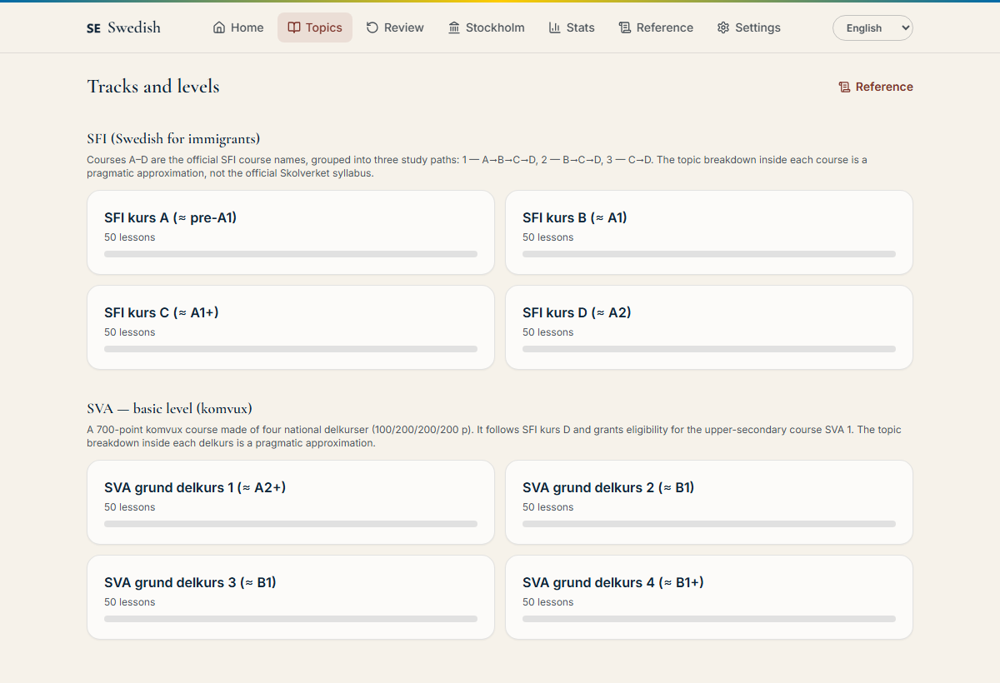</td>
    <td width="33%">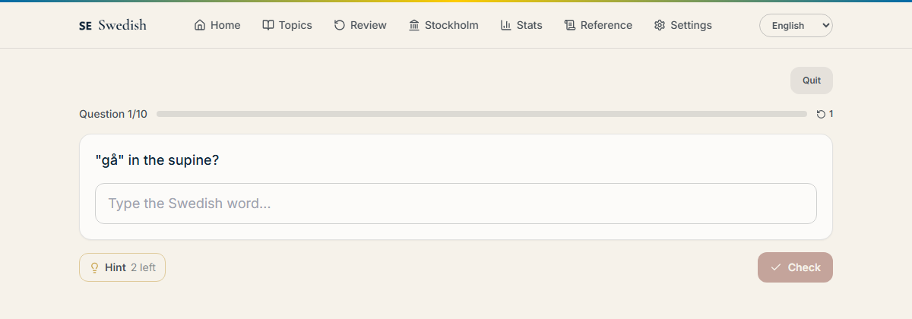</td>
    <td width="33%">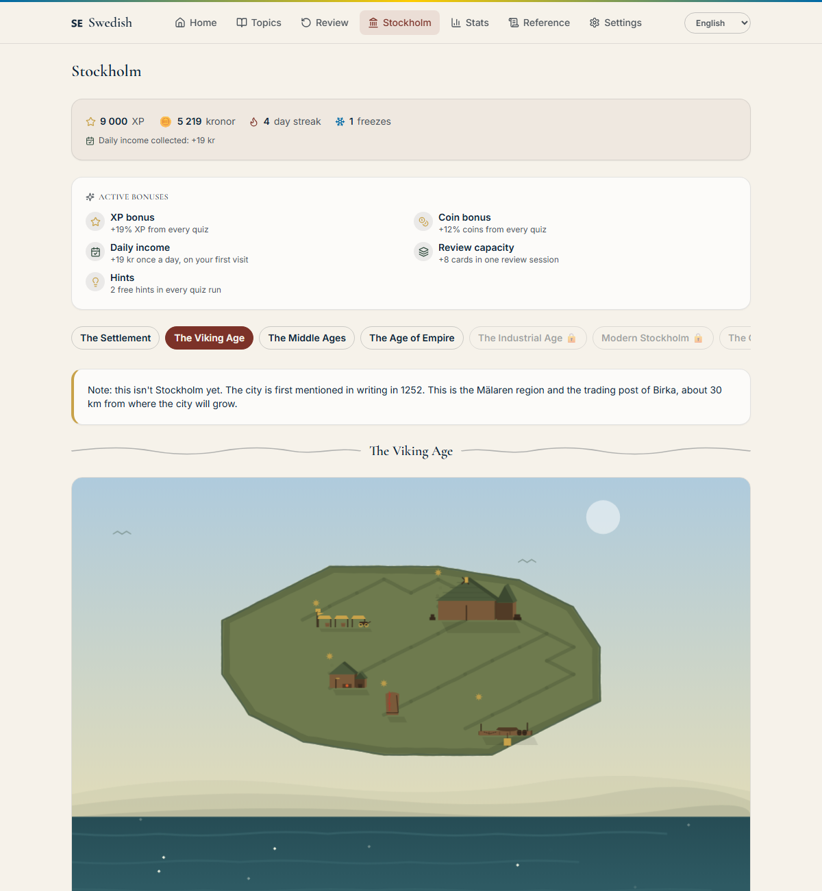</td>
  </tr>
  <tr>
    <td align="center"><sub><b>Topics and levels</b></sub></td>
    <td align="center"><sub><b>A quiz in progress</b></sub></td>
    <td align="center"><sub><b>Your Stockholm</b></sub></td>
  </tr>
</table>

### One island, ten ages

Each shot is an era with every one of its buildings finished — what the map looks like just
before the next era opens. The first six are real history; the last four are informed
guesses, and the app says so ([SPEC.md §12.8](specs/12-history.md)).

<table>
  <tr>
    <td width="20%">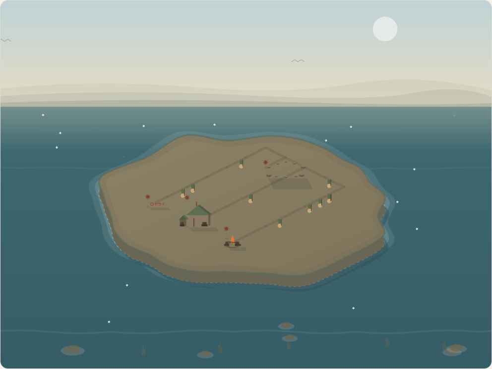<br><sub><b>1.</b> The Settlement</sub></td>
    <td width="20%">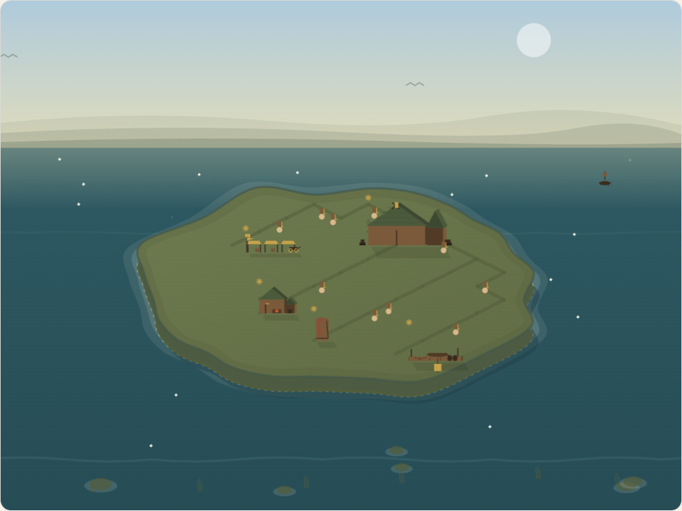<br><sub><b>2.</b> The Viking Age</sub></td>
    <td width="20%">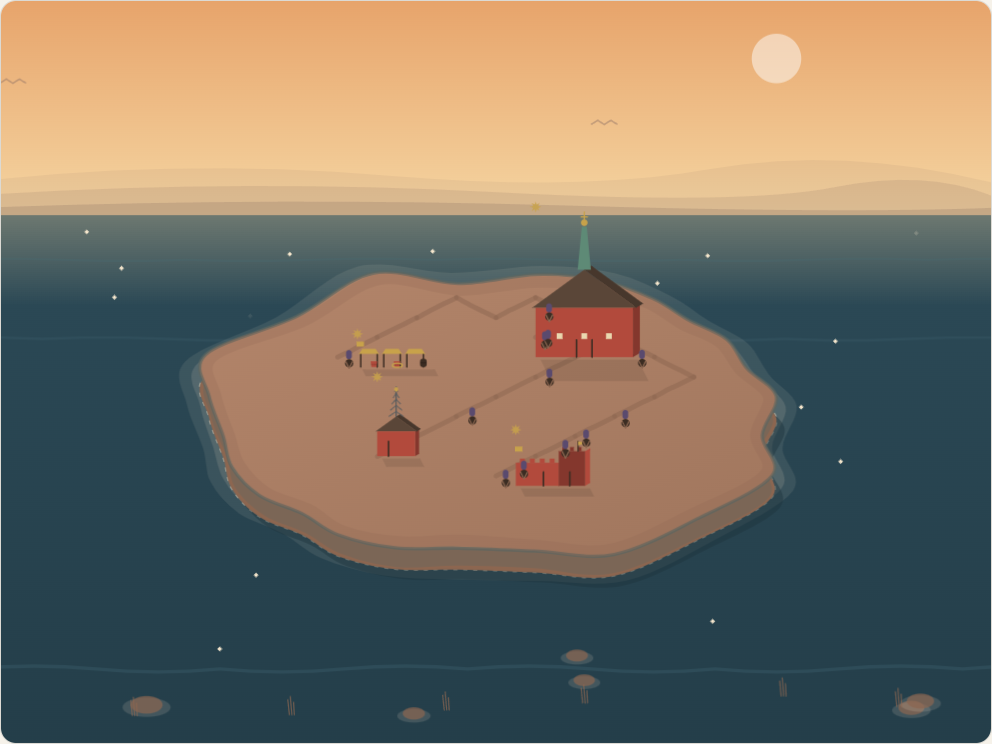<br><sub><b>3.</b> The Middle Ages</sub></td>
    <td width="20%">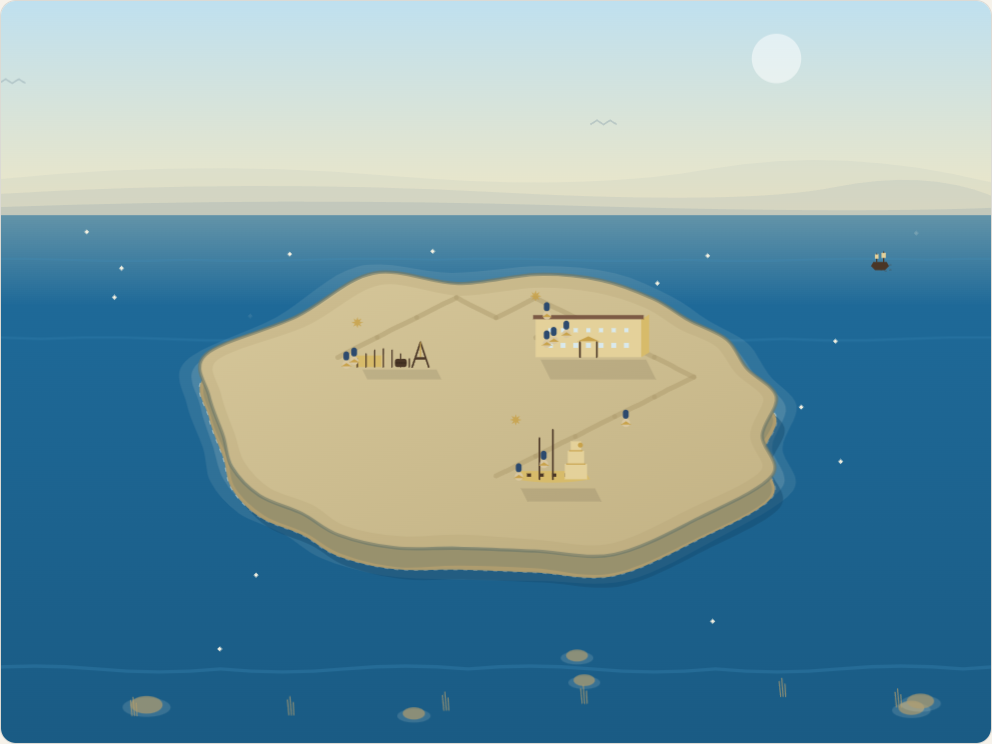<br><sub><b>4.</b> The Age of Empire</sub></td>
    <td width="20%">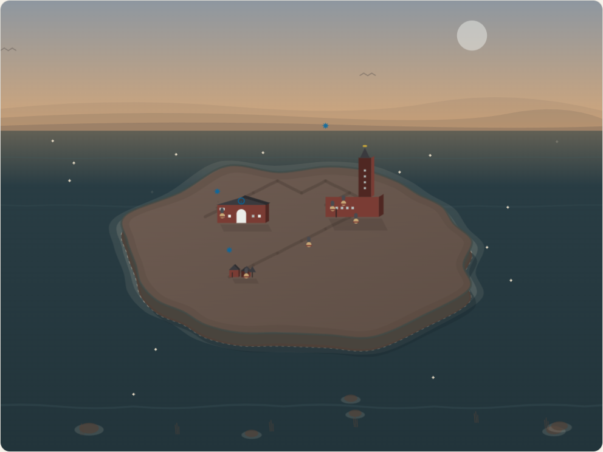<br><sub><b>5.</b> The Industrial Age</sub></td>
  </tr>
  <tr>
    <td>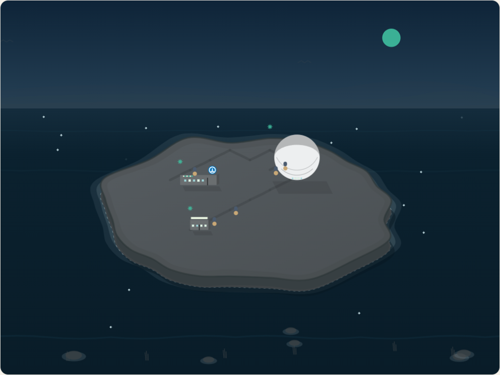<br><sub><b>6.</b> Modern Stockholm</sub></td>
    <td>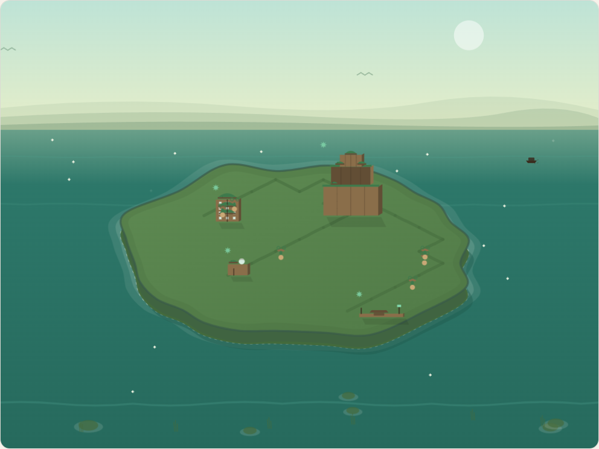<br><sub><b>7.</b> The Green City</sub></td>
    <td>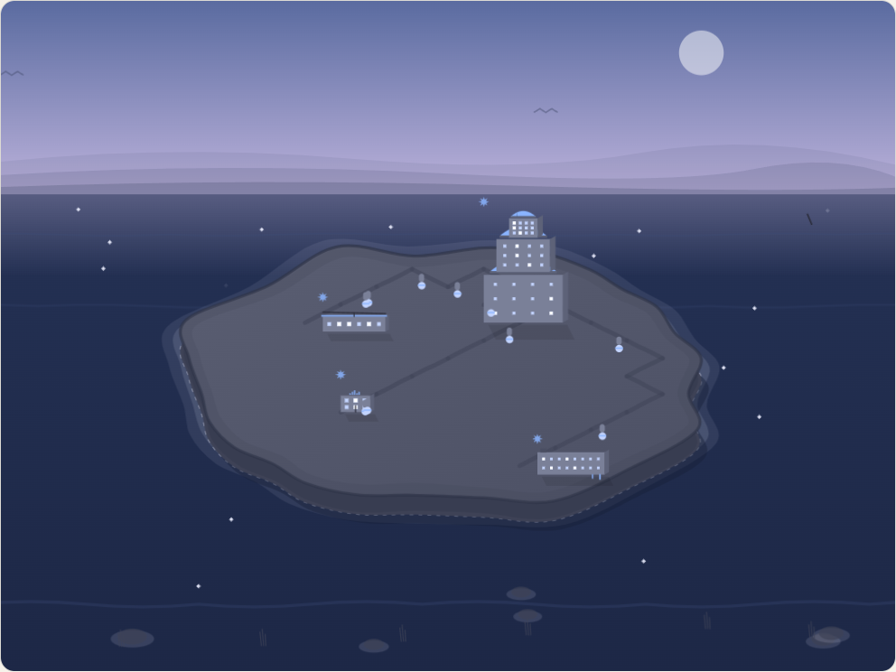<br><sub><b>8.</b> The Connected City</sub></td>
    <td>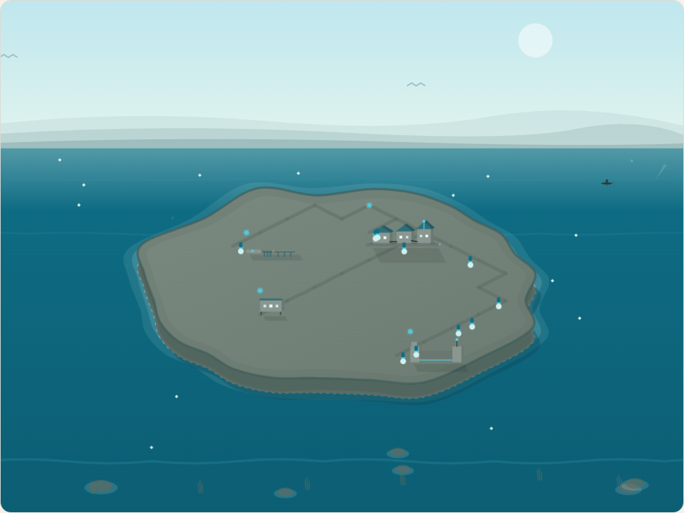<br><sub><b>9.</b> The Floating City</sub></td>
    <td>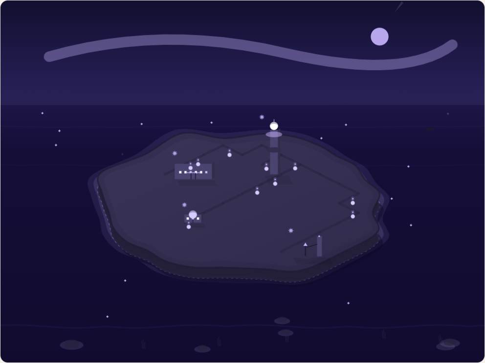<br><sub><b>10.</b> The Star City</sub></td>
  </tr>
</table>

## How it works

1. **Pick a topic.** Two tracks in order, SFI (kurs A–D) and then SVA grundläggande
   (delkurs 1–4). Opening a level takes you straight to the first topic you haven't passed.
2. **Read and listen.** Short theory and a word list for each lesson, with every form of each
   word, an example sentence, and `sv-SE` speech on anything Swedish — a tap is enough.
3. **Take the test.** Ten questions drawn from the lesson's pool, with feedback after each
   one. You get one free retry per run and no lives, and you can't lose progress.
4. **Build Stockholm.** Spend your XP and coins on the city. Its buildings give perks
   (hint tokens, extra retries, XP and coin multipliers, daily income) that make the next
   lesson easier. Every new building and upgrade goes up with fireworks.

## Features

|  |  |
|---|---|
| 📚 **Lessons by level** | 400 five-minute lessons across SFI A–D and SVA grund 1–4; a longer topic is split into numbered parts |
| 🔊 **Audio everywhere** | Speech synthesis on every Swedish word, form, example and dialogue line, with a voice and speed picker; a Swedish word in a test is spoken as you pick it |
| 🧩 **Quiz engine** | Multiple choice, listening, typed answers, gap fills, word order, matching and true/false, weighted-sampled from each lesson's pool, with typo tolerance on typed answers |
| 🔁 **Spaced repetition** | One Leitner-box review deck across every lesson you have studied |
| 📖 **Reference** | Grammar summaries, a searchable dictionary of every word taught, and 31 everyday dialogues you can listen to or act out one role at a time |
| 🏙️ **The city** | Ten eras and 38 buildings drawn as an isometric scene with citizens, boats, weather and lights at night; each building gives a perk |
| 📜 **History cards** | Short, sourced notes (Birka, the rune stones, the first written mention in 1252, the Vasa, the metro) unlocked by the buildings they belong to |
| 🔥 **Streaks and achievements** | Daily streak with freezes, 36 achievements with up to six tiers each, and a stats page with medals and progress |
| 🌗 **Comfortable to use** | Light and dark themes, keyboard navigation, `prefers-reduced-motion` respected, sounds you can mute |
| 🇬🇧 🇷🇺 **Two interface languages** | One switch changes the interface and every translation shown |
| 💾 **Local-first** | Everything lives in `localStorage`; export and import a JSON save file |
| ☁️ **Cloud sync (optional)** | Sign in with Google to sync across devices, merged field by field so nothing is lost |

## Getting started

```bash
git clone https://github.com/gray0072/swedish.git
cd swedish
npm install
npm run dev        # http://localhost:5173/swedish/
```

| Command | What it does |
|---|---|
| `npm run dev` | Dev server with hot reload |
| `npm test` | Vitest unit tests — quiz engine, grading, selection weighting, SRS, city |
| `npm run validate` | Validates every content file against its Zod schema |
| `npm run build` | Type-check and production build into `dist/` |
| `npm run preview` | Serve the production build locally |
| `npm run new:lesson` | Scaffold a new lesson folder |
| `npm run screenshots` | Regenerate the README screenshots from the running app (see below) |

## Tech stack

<p>
  
  
  
  
  
  
  
  
</p>

- **React 18 + TypeScript (strict)**, built with **Vite 6**; content is loaded with `import.meta.glob`.
- **React Router** with `HashRouter`, so GitHub Pages needs no server configuration.
- **Zustand** for app state, persisted to `localStorage`.
- **Zod** content schemas, checked at build time and in CI.
- **Tailwind CSS** with a small Swedish palette: falu red, birch, gold, pine and aurora. There
  is no component library.
- **Web Speech API** for pronunciation and **Web Audio API** for sound effects. Every sound is
  synthesized, so the app ships no audio files.
- **vite-plugin-pwa** for install and offline use.
- **Supabase** (Auth with Google PKCE, plus Postgres) is optional and used only for sync.

## Documentation

Every document is in English; the ones marked 🇷🇺 also have a Russian translation next to
them with the `_ru` suffix.

| Document | What's in it |
|---|---|
| [SPEC.md](SPEC.md) 🇷🇺 | The product spec (an index of [specs/](specs/)), which has the final say on design decisions |
| [CURRICULUM.md](specs/CURRICULUM.md) 🇷🇺 | The lesson-topic plan for every level; start here when picking what to write next |
| [REFERENCE.md](specs/REFERENCE.md) 🇷🇺 · [DIALOGUES.md](specs/DIALOGUES.md) 🇷🇺 | Plans for the reference section and the dialogues |
| [CITY_VISUALS.md](specs/CITY_VISUALS.md) | How the city scene is built: grid, buildings, motion, life |
| [TODO.md](TODO.md) 🇷🇺 | Outstanding work, content gaps and known discrepancies |
| [CHANGELOG.md](CHANGELOG.md) 🇷🇺 | Development log |
| [AGENTS.md](AGENTS.md) | Rules for contributors, human or agent |

<details>
<summary><b>Build &amp; deploy</b></summary>

<br>

A push to `main` runs [`.github/workflows/deploy.yml`](.github/workflows/deploy.yml), which
validates content, runs the tests, builds, and publishes `dist/` through the official
`actions/upload-pages-artifact` + `actions/deploy-pages` flow (Settings → Pages → Source:
**GitHub Actions**). `vite.config.ts` sets `base: '/swedish/'` to match the repo name —
update it if the repo is ever renamed or moved to a custom domain.

`npm run deploy` (via the `gh-pages` package) is a manual alternative that publishes a local
build to a `gh-pages` branch instead of waiting on CI.

</details>

<details>
<summary><b>Cloud sync — setting it up for your own fork</b></summary>

<br>

Progress works fully offline out of the box (`localStorage` + export/import). Signing in with
Google in Settings additionally syncs the same save file through a Supabase project — merged
field by field (lessons, SRS items, buildings, wallet, streak, …) so progress made on two
devices between syncs is combined rather than one side overwriting the other. Full scheme:
[SPEC.md §7.1](specs/07-progress-and-sync.md#71-optional-cloud-sync--supabase).

1. Create a free [Supabase](https://supabase.com/) project.
2. Run [supabase/schema.sql](supabase/schema.sql) once in its SQL editor — one `saves` table
   with row-level security scoping every row to its own user.
3. Enable the Google auth provider (Authentication → Providers), which needs a Google Cloud
   OAuth client id/secret, and add your dev and prod URLs under Authentication → URL
   Configuration → Redirect URLs.
4. Copy `.env.example` to `.env.local` and fill in `VITE_SUPABASE_URL` /
   `VITE_SUPABASE_ANON_KEY` from Project Settings → API. Neither value is secret — the anon
   key ships in the client bundle by design and RLS is what protects the data — but
   `.env.local` is gitignored anyway to keep per-fork keys out of the repo.
5. For the CI deploy, add the same two values as **repository secrets** (Settings → Secrets
   and variables → Actions) named exactly `VITE_SUPABASE_URL` and `VITE_SUPABASE_ANON_KEY`.
   Skipping this is the usual reason a deployed build has no sign-in button — it isn't
   broken, it just built without them.

Without those variables the app builds and runs exactly the same, with cloud sync compiled
out.

**Google sign-in redirects to `localhost` on the deployed site?** That is a Supabase setting,
not a code bug: Supabase falls back to its **Site URL** (default `http://localhost:3000`)
whenever the real redirect isn't in the **Redirect URLs** allow list. Set Site URL to your
deployed URL (e.g. `https://<user>.github.io/swedish/`) and add both that and
`http://localhost:5173/swedish/` to Redirect URLs.

</details>

<details>
<summary><b>Screenshots — how they are made</b></summary>

<br>

Every shot except the quiz one is generated from the running app by `npm run screenshots`
([scripts/screenshots.ts](scripts/screenshots.ts)). It boots the dev server, seeds a
throwaway finished save and drives your installed Chrome. Add `-- pages` or `-- eras` to redo
only that half. Re-run it whenever the scene or the chrome around it changes, and never edit
those PNGs by hand.

The banner at the top, [docs/banner.png](docs/banner.png), which is also the repository's
social preview, is rendered from [docs/banner.html](docs/banner.html) at 1280×640.
The link preview of the deployed app, [public/og-image.png](public/og-image.png), is rendered
from [docs/og-image.html](docs/og-image.html) at 1200×630.

</details>

<details>
<summary><b>Project structure</b></summary>

<br>

```
content/                  all learning content — lessons, vocab, questions, city, history
  lessons/<level>/<slug>/   lesson.json, theory.md, theory_ru.md, vocab.json, questions.json
  curricula/                ordered lesson-id playlists per track
  dialogues/                everyday dialogues for the reference section
  reference/                grammar summaries (English + _ru)
  city/                     eras.json, buildings.json
  history/                  short sourced history cards
src/
  content/                  Zod schemas, the content loader/registry, vocab → quiz generators
  quiz/                     session creation, weighted selection, grading, hints, reward math
  srs/                      Leitner-box review scheduler
  city/                     economy, perks, era progress
  store/                    Zustand store (wallet, progress, city, settings), save/export/import,
                            optional Supabase cloud sync
  components/, pages/       UI; the city scene lives in components/city/scene
  lib/                      speech, synthesized sounds, share card, helpers
scripts/                    content validation, lesson scaffolder, screenshot generator
supabase/                   schema.sql — the `saves` table + RLS policies
tests/                      Vitest unit tests
```

</details>

## License

[MIT](LICENSE). The Swedish is Sweden's; the mistakes are ours — issues and pull requests are
welcome.
